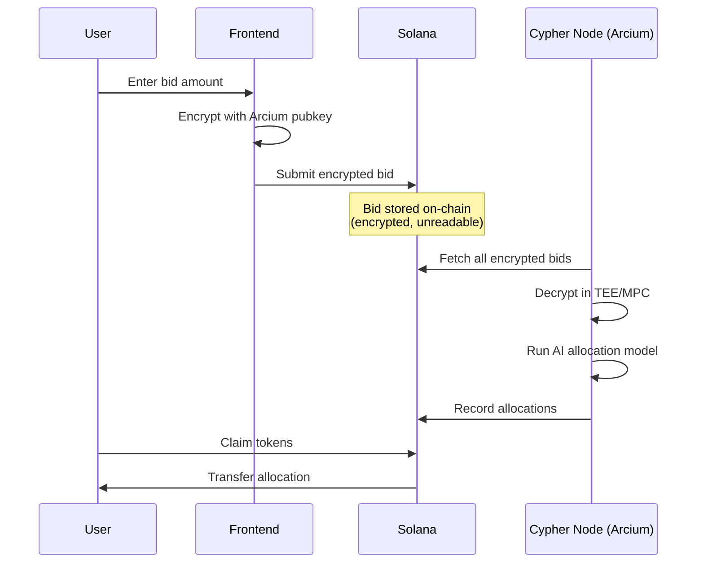

<p align="center">
  
  
  
</p>

<h1 align="center">
  <br>
  🔮 OBSIDIAN
  <br>
  <sub>The Dark Launchpad</sub>
</h1>

<p align="center">
  <strong>A privacy-preserving token launchpad on Solana powered by Arcium confidential computing.</strong>
</p>

<p align="center">
  <a href="#-the-problem">Problem</a> •
  <a href="#-the-solution">Solution</a> •
  <a href="#-architecture">Architecture</a> •
  <a href="#-demo">Demo</a> •
  <a href="#-tech-stack">Tech Stack</a> •
  <a href="#-getting-started">Getting Started</a>
</p>

---

## 🚨 The Problem

Traditional token launchpads are **fundamentally broken**:

| Issue | Impact |
|-------|--------|
| 📊 **Public Bid Visibility** | Whales see your bid and outbid you |
| 🤖 **MEV & Front-running** | Bots extract value before your transaction |
| 💰 **Price Manipulation** | Bad actors inflate demand artificially |
| ⚖️ **Unfair Allocations** | Small bidders systematically disadvantaged |

> *"In DeFi, if your bid is public, you've already lost."*

---

## 💡 The Solution

**Obsidian** introduces **encrypted bidding** with **confidential compute**:

```
┌─────────────────────────────────────────────────────────────────┐
│                                                                 │
│   🔒 Your bid is encrypted BEFORE it leaves your browser       │
│                                                                 │
│   🔐 Only Arcium's MPC network can decrypt                     │
│                                                                 │
│   🤫 Individual bid amounts are NEVER revealed                  │
│                                                                 │
│   ⚖️ Fair allocation via AI scoring inside the enclave         │
│                                                                 │
└─────────────────────────────────────────────────────────────────┘
```

**Zero leaks. Verifiable. Secure execution inside the enclave.**

---

## 🏗️ Architecture



### Key Innovation

The **Cypher Node** operates in Arcium's confidential compute environment:
- 🔐 **NaCl Box Encryption** — Asymmetric encryption with perfect forward secrecy
- 🧠 **AI Scoring Model** — Evaluates bids fairly without exposing amounts
- ⛓️ **On-Chain Proofs** — Allocations are verifiable without revealing inputs

---

## 🎬 Demo

| Step | Screenshot |
|------|------------|
| **1. Connect Wallet** | Dark enclave aesthetic with luminous purple accents |
| **2. Enter Bid** | Amount encrypted client-side before submission |
| **3. Bid Confirmed** | Encrypted payload stored on Solana |
| **4. Allocation Revealed** | Cypher Node processes, user sees result |
| **5. Claim Tokens** | SPL tokens transferred to user's wallet |

**Live Demo:** [Your Vercel URL]

---

## 🔧 Tech Stack

<table>
<tr>
<td width="50%">

### Blockchain Layer
- **Solana** — High-performance L1
- **Anchor** — Rust smart contract framework
- **SPL Token** — Standard token operations

</td>
<td width="50%">

### Confidentiality Layer
- **Arcium** — MPC infrastructure
- **TweetNaCl** — Box encryption (curve25519-xsalsa20-poly1305)
- **Cypher Node** — Trusted compute execution

</td>
</tr>
<tr>
<td width="50%">

### Frontend
- **Next.js 15** — React framework
- **TailwindCSS** — Utility-first styling
- **Framer Motion** — Smooth animations
- **Wallet Adapter** — Multi-wallet support

</td>
<td width="50%">

### Design System
- **Background:** `#0B0E17` → `#120A1F`
- **Primary:** `#9B6CFF` Luminous Purple
- **Signal:** `#6AE3FF` ZK Cyan
- **Glass-morphism** with encrypted enclave orb

</td>
</tr>
</table>

---

## 📂 Project Structure

```
obsidian/
├── programs/obsidian/src/
│   └── lib.rs              # Anchor program (Rust)
├── src/
│   ├── app/                # Next.js pages
│   ├── components/         # React components
│   │   ├── Hero.tsx        # Landing hero
│   │   ├── BidForm.tsx     # Bid submission + claim
│   │   └── Navbar.tsx      # Wallet connection
│   └── lib/
│       └── arcium.ts       # Encryption utilities
├── scripts/
│   ├── run-cypher-demo.ts  # Cypher Node processing
│   ├── initialize-devnet.ts # Deploy + initialize
│   └── fund-launch-pool.ts # Fund tokens for claims
└── README.md
```

---

## 🚀 Getting Started

### Prerequisites
- Node.js 18+
- Rust + Anchor CLI
- Solana CLI (configured for Devnet)

### Installation

```bash
# Clone repository
git clone https://github.com/michealimuse777/Obsidian.git
cd Obsidian

# Install dependencies
npm install

# Start development server
npm run dev
```

### Deploy Program (Optional)

```bash
# Build and deploy to Devnet
anchor build
anchor deploy

# Initialize launch
npx ts-node scripts/initialize-devnet.ts
```

### Process Bids (Cypher Node)

```bash
# After users place bids, run the Cypher Node
npx ts-node scripts/run-cypher-demo.ts
```

---

## 📊 Deployed Instance

| Component | Value |
|-----------|-------|
| **Program ID** | `8nkjktP5dWDYCkwR3fJFSuQANB1vyw5g5LTHCrxnf3CE` |
| **Network** | Solana Devnet |
| **Frontend** | Vercel |

---

## 🔐 Security Model

| Layer | Protection |
|-------|------------|
| **Client** | NaCl Box encryption before network transmission |
| **Transport** | TLS + encrypted Solana transactions |
| **Storage** | On-chain data is encrypted, unreadable without Cypher Node |
| **Processing** | Arcium MPC — no single party can decrypt |
| **Verification** | On-chain allocations are publicly auditable |

---

## 🗺️ Roadmap

- [x] Encrypted bidding with Arcium
- [x] On-chain allocation recording
- [x] SPL token claims
- [x] Premium dark UI aesthetic
- [ ] Full Arcium MPC integration (multi-node threshold)
- [ ] Token-2022 confidential transfers
- [ ] DAO governance for launch parameters
- [ ] Multi-round auction support

---

## 🏆 Built For

<p align="center">
  <strong>Arcium × Solana Hackathon</strong>
  <br><br>
  <em>"Making DeFi fair again, one encrypted bid at a time."</em>
</p>

---

## 📄 License

MIT License — see [LICENSE](LICENSE) for details.

---

<p align="center">
  <sub>Built with 🔮 by the Obsidian Team</sub>
</p>
