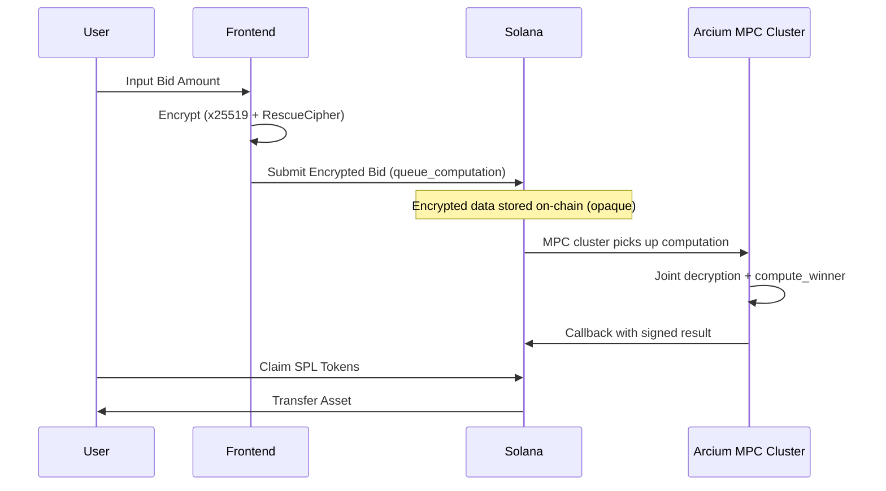

# Obsidian | The Dark Launchpad

**Privacy-Preserving Blind Auction on Solana powered by Arcium v0.8.4 Confidential Computing.**

[](https://solana.com)
[](https://arcium.com)

---

## Trust Model

> **Obsidian integrates Arcium v0.8.4 to execute blind auction allocation logic via decentralized Multi-Party Computation (MPC). All bids are encrypted client-side using Arcium's x25519 + RescueCipher, never decrypted on-chain, and never visible to protocol operators. Only final auction results are committed to Solana. No single MPC node can learn individual bid values.**

---

## How It Works



**Key invariants:**
- Arcium owns decryption authority, not the protocol
- The Solana program defines WHAT to compute
- Arcium executes HOW to compute confidentially
- Frontend only encrypts + submits
- No server, no single-node key holder, no off-chain callbacks

---

## Repository Structure

```
obsidian/
├─ programs/
│  └─ obsidian/
│     ├─ src/lib.rs           # Solana + Arcium Anchor program
│     └─ Cargo.toml
├─ encrypted-ixs/
│  ├─ src/lib.rs              # Arcis MPC computation logic
│  └─ Cargo.toml
├─ src/                       # Next.js frontend
│  ├─ lib/arcium.ts           # Arcium SDK encryption client
│  ├─ components/BidForm.tsx   # Encrypted bid UI
│  └─ ...
├─ tests/obsidian.ts          # Arcium integration tests
├─ Anchor.toml
├─ Arcium.toml
└─ README.md
```

**Why this structure:**
- `programs/*` → Solana + Arcium Anchor program (`#[arcium_program]`)
- `encrypted-ixs/` → Confidential computation logic (Arcis MPC code)
- `src/` → Browser encryption + UX (Next.js)

---

## Technical Stack

### Blockchain Infrastructure
- **Solana** — Layer 1 consensus and settlement
- **Anchor 0.30.1** — Rust smart contract framework
- **SPL Token / Token-2022** — Standardized token operations

### Arcium Confidential Computing (v0.8.4)
- **arcium-anchor** — Anchor integration (`#[arcium_program]`, `queue_computation`, `#[arcium_callback]`)
- **arcium-macros** — `comp_def_offset` and callback macros
- **arcium-client** — On-chain account derivation and transaction building
- **arcis** — MPC circuit DSL (`#[encrypted]`, `#[instruction]`, `Enc<Mxe, T>`)
- **@arcium-hq/client** — TypeScript SDK for x25519, RescueCipher, computation tracking

### Frontend
- **Next.js 16** — React framework
- **TailwindCSS** — Design system
- **@noble/curves** — x25519 key exchange
- **Solana Wallet Adapter** — Wallet connection

---

## Confidential Computation Flow

### 1. Computation Definition Init (One-Time)
```
init_winner_comp_def() → init_comp_def() → registers compute_winner with Arcium
```

### 2. Encrypted Bid Submission
```
Client: x25519 ECDH → RescueCipher.encrypt(bid_amount)
Solana: ArgBuilder → queue_computation() → Arcium mempool
```

### 3. MPC Execution (Automatic)
```
MPC Cluster: joint decrypt → execute compute_winner → signed result
```

### 4. Callback + Claim
```
#[arcium_callback] → emit WinnerComputed event
User: claim_tokens() → SPL transfer from launch pool
```

---

## Encrypted Instructions (Arcis)

The confidential logic in `encrypted-ixs/src/lib.rs`:

| Instruction | Input | Output | Purpose |
|---|---|---|---|
| `compute_winner` | `Enc<Mxe, BidInput>` × 2 | `Enc<Mxe, u64>` | Pairwise bid comparison |
| `compute_allocation` | `Enc<Mxe, BidInput>` + `Enc<Mxe, PoolInfo>` | `Enc<Mxe, u64>` | Proportional token allocation |

All inputs use `Enc<Mxe, T>` — only the MXE can decrypt. Individual bidders never see each other's bids.

---

## Deployment

- **Program ID:** `6XDoHizZE4avqDJbtdM8oqZinHSVP13LpMYhuivrmdoy`
- **Network:** Solana Devnet
- **MXE Account:** `2f76rcSC8yxxwcaumrh38t38tYk3ZGqJaRznQphwrj8o`
- **Cluster Offset:** 456
- **Build:** `arcium build` (requires Arcium CLI via `arcup`)
- **Test:** `node --import tsx node_modules/mocha/bin/mocha.js --timeout 1000000 tests/obsidian.ts`
- **Deploy:** `solana program deploy target/deploy/obsidian.so --program-id target/deploy/obsidian-keypair.json -u devnet`

---

## Security Model

1. **Client-Side Encryption:** Bids encrypted with x25519 + RescueCipher before leaving the browser
2. **MPC Execution:** No single node can decrypt — joint computation across the Arcium MPC cluster
3. **On-Chain Verification:** Callback results are signed by the cluster and verified on-chain
4. **State Integrity:** Solana guarantees immutability of the encrypted ledger and final allocation record

---

## Checklist

- [x] Arcium v0.8.4 everywhere
- [x] `#[arcium_program]` macro
- [x] `queue_computation` / `init_comp_def` / `#[arcium_callback]`
- [x] Encrypted logic in `encrypted-ixs/` (Arcis)
- [x] Frontend encrypts with `@arcium-hq/client` SDK
- [x] MPC computes allocation (no server, no single-node keys)
- [x] No `callback_url` — fully on-chain
- [x] README explains trust model
- [x] Deployed to Solana Devnet
- [x] Circuits uploaded and finalized on-chain

---

*Developed for the Arcium × Solana Hackathon.*
