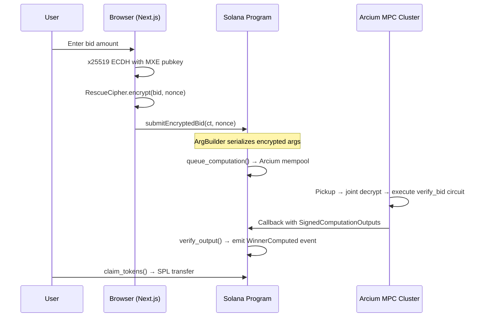

# Obsidian | The Dark Launchpad

**Privacy-Preserving Blind Auction on Solana powered by Arcium v0.8.5 Confidential Computing.**

[](https://solana.com)
[](https://arcium.com)
[](https://www.anchor-lang.com/)
[](https://nextjs.org)

---

## Overview

Obsidian is a trustless blind auction protocol for token launches. Bidders submit encrypted bids that are **never visible to anyone** — not the protocol operator, not Solana validators, not other bidders. Bid comparison and allocation are computed inside Arcium's decentralized Multi-Party Computation (MPC) network, and only the final results are committed to Solana.

**No server. No single-key holder. No off-chain callbacks. Fully on-chain confidential computation.**

---

## Trust Model

> **All bids are encrypted client-side using x25519 ECDH + RescueCipher before leaving the browser. The encrypted ciphertext is stored on-chain as opaque data. Arcium's MPC cluster — a decentralized set of independent nodes — jointly decrypts and computes the auction result without any single node ever seeing a plaintext bid. Results are cryptographically signed by the cluster and verified on-chain before state transitions occur.**

### What This Means in Practice

| Property | How It's Achieved |
|---|---|
| **Bid privacy** | x25519 key exchange + Rescue-Prime cipher; ciphertext is 32 bytes per field element |
| **No single point of trust** | Arcium MPC cluster requires threshold participation — no individual node can decrypt |
| **Verifiable computation** | Cluster signs outputs; `verify_output()` checks signature on-chain in the callback |
| **Immutable audit trail** | Solana stores encrypted bids and signed results permanently |
| **No oracle dependency** | MPC cluster is the only external party; it executes the circuit defined by the program |

---

## Architecture



---

## Technical Deep Dive

### Encryption Pipeline

The client performs x25519 Diffie-Hellman key exchange with the MXE (Multi-execution Environment) to derive a shared secret, then encrypts bid values using Arcium's Rescue-Prime sponge cipher:

```
1. privateKey  = x25519.randomSecretKey()
2. publicKey   = x25519.getPublicKey(privateKey)
3. mxePubKey   = getMXEPublicKey(provider, programId)   // fetched on-chain
4. sharedKey   = x25519.getSharedSecret(privateKey, mxePubKey)
5. cipher      = new RescueCipher(sharedKey)
6. ciphertext  = cipher.encrypt([BigInt(bidAmount)], nonce)   // → [u8; 32]
```

**Rescue-Prime** is an algebraic hash/cipher designed for arithmetic circuits (SNARKs/MPC). It operates over the scalar field of Curve25519 (`F_{2^255-19}`), making it efficient inside Arcium's MPC protocol while providing 128-bit security.

### Solana Program (Anchor)

The program uses Arcium's Anchor SDK macros:

```rust
#[arcium_program]
pub mod obsidian_auction {
    // Queue encrypted computation via CPI to Arcium program
    pub fn submit_encrypted_bid(ctx, computation_offset, encrypted_amount, nonce) {
        let args = ArgBuilder::new()
            .plaintext_u128(nonce)          // Rescue cipher nonce
            .encrypted_u64(encrypted_amount) // Encrypted bid (32 bytes)
            .build();

        queue_computation(ctx.accounts, computation_offset, args, callbacks, 1, 0)?;
    }

    // Called by MPC cluster when computation finishes
    #[arcium_callback(encrypted_ix = "verify_bid")]
    pub fn verify_bid_callback(ctx, output: SignedComputationOutputs<VerifyBidOutput>) {
        let result = output.verify_output(&cluster_account, &computation_account)?;
        emit!(WinnerComputed { winning_ciphertext: result.ciphertexts[0], nonce: ... });
    }
}
```

**Key macros:**
- `#[arcium_program]` — Enables Arcium CPI integration on an Anchor program
- `#[queue_computation_accounts("verify_bid", payer)]` — Derives all required Arcium accounts
- `#[arcium_callback(encrypted_ix = "verify_bid")]` — Defines the MPC result handler
- `#[init_computation_definition_accounts("verify_bid", payer)]` — Initializes circuit metadata on-chain
- `comp_def_offset("verify_bid")` — Deterministic PDA seed for computation definition

### Arcis Circuit (MPC Logic)

The confidential computation logic runs inside Arcium's MPC network. Written in Arcis DSL:

```rust
#[encrypted]
mod circuits {
    use arcis::*;

    // Process a single encrypted bid — identity pass-through
    // for validation. Uses Enc<Mxe, u64> (MXE-owned encryption).
    #[instruction]
    pub fn verify_bid(bid_amount: Enc<Mxe, u64>) -> Enc<Mxe, u64> {
        let amount = bid_amount.to_arcis();
        bid_amount.owner.from_arcis(amount)
    }

    // Pairwise comparison of two encrypted bids
    #[instruction]
    pub fn compute_winner(
        bid_a: Enc<Mxe, BidInput>,
        bid_b: Enc<Mxe, BidInput>,
    ) -> Enc<Mxe, u64> {
        let a = bid_a.to_arcis();
        let b = bid_b.to_arcis();
        let winner = if a.amount > b.amount { a.amount } else { b.amount };
        bid_a.owner.from_arcis(winner)
    }

    // Proportional allocation: (bid * 100) / total_pool
    #[instruction]
    pub fn compute_allocation(
        bid_amount: Enc<Mxe, u64>,
        total_pool: Enc<Mxe, u64>,
    ) -> Enc<Mxe, u64> {
        let b = bid_amount.to_arcis();
        let p = total_pool.to_arcis();
        let pct = if p > 0 { b * 100 / p } else { 0u64 };
        bid_amount.owner.from_arcis(pct)
    }
}
```

**`Enc<Mxe, T>`** — Data encrypted with the MXE's key. Only the MPC cluster can jointly decrypt it. The program never sees plaintext. `.to_arcis()` converts to the MPC computation domain, `.from_arcis()` re-encrypts the result for the MXE.

### ArgBuilder Encoding

The Arcium program validates that the argument buffer matches the circuit's type signature:

| Circuit Input Type | ArgBuilder Encoding |
|---|---|
| `Enc<Mxe, u64>` | `.plaintext_u128(nonce)` + `.encrypted_u64(ct)` |
| `Enc<Mxe, BidInput>` (struct) | `.plaintext_u128(nonce)` + per-field `.encrypted_*()` |
| `Enc<Shared, T>` | `.x25519_pubkey(pk)` + `.plaintext_u128(nonce)` + per-field `.encrypted_*()` |

Each `Enc<Mxe, ...>` argument group needs one nonce. Struct fields are flattened into individual `encrypted_*` calls matching the field types.

---

## Repository Structure

```
obsidian/
├─ programs/obsidian/
│  └─ src/lib.rs              # Anchor program: 7 instructions, 8 account structs
│                               # submit_encrypted_bid, verify_bid_callback,
│                               # compute_winner_callback, compute_allocation_callback,
│                               # initialize_launch, record_allocation, 
│                               # finalize_launch, claim_tokens
├─ encrypted-ixs/
│  └─ src/lib.rs              # Arcis circuits: verify_bid, compute_winner, compute_allocation
├─ src/                       # Next.js 16 frontend
│  ├─ lib/arcium.ts           # Arcium SDK: encryption, key exchange, cipher
│  ├─ components/BidForm.tsx  # Encrypted bid submission UI
│  ├─ utils/constants.ts      # Program IDs, network config
│  └─ config/network.ts       # Devnet/mainnet RPC endpoints
├─ tests/obsidian.ts          # Mocha integration tests (devnet)
├─ scripts/
│  ├─ init-comp-defs.cjs      # Initialize computation definitions
│  ├─ upload-and-finalize.ts  # Upload circuits + finalize comp defs
│  └─ finalize-comp-defs.ts   # Finalize computation definitions
├─ Anchor.toml                # Anchor config (program ID, cluster)
├─ Arcium.toml                # Arcium config (network, cluster offset)
└─ target/
   ├─ deploy/obsidian.so      # Compiled BPF program
   └─ idl/obsidian.json       # Anchor IDL
```

---

## Deployment

| Item | Value |
|---|---|
| **Program ID** | `CsS69vzRAZ4dJXFg68tTnP2ei4XCbYzPENdzQnBWU5Ua` |
| **Network** | Solana Devnet |
| **MXE Account** | `CgWuDfFvm4729GuvwJB26jPd17MhWWjfjKzrEjQMmStv` |
| **Arcium Cluster Offset** | 456 |
| **Arcium CLI** | v0.8.5 (install via `arcup`) |
| **Anchor** | 0.30.1 |
| **Circuits Finalized** | `verify_bid`, `compute_winner`, `compute_allocation` |

### Build & Deploy

```bash
# Install Arcium CLI
curl -sSf https://raw.githubusercontent.com/arcium-hq/arcup/main/install.sh | sh
arcup

# Build (compiles Anchor program + Arcis circuits)
arcium build

# Deploy to devnet
solana program deploy target/deploy/obsidian.so \
  --program-id target/deploy/obsidian-keypair.json \
  -u devnet --with-compute-unit-price 50000

# Upload circuits and finalize computation definitions
ARCIUM_CLUSTER_OFFSET=456 node --import tsx scripts/upload-and-finalize.ts

# Run integration tests
ARCIUM_CLUSTER_OFFSET=456 node --import tsx \
  node_modules/mocha/bin/mocha.js --timeout 1000000 tests/obsidian.ts
```

---

## Program Instructions

| Instruction | Access | Description |
|---|---|---|
| `initialize_launch` | Authority | Creates launch PDA, SPL mint, token pool |
| `init_verify_bid_comp_def` | Authority | Registers `verify_bid` circuit with Arcium |
| `init_winner_comp_def` | Authority | Registers `compute_winner` circuit with Arcium |
| `init_allocation_comp_def` | Authority | Registers `compute_allocation` circuit with Arcium |
| `submit_encrypted_bid` | Any bidder | Encrypts bid → `queue_computation` → MPC mempool |
| `verify_bid_callback` | MPC cluster | Receives signed MPC result, emits `WinnerComputed` |
| `record_allocation` | Authority | Records MPC-computed allocation per bidder |
| `finalize_launch` | Authority | Marks auction as final, enables claims |
| `claim_tokens` | Bidder | SPL transfer from launch pool based on allocation |

### Account PDAs

```
launch          → seeds: ["launch_v3"]
bid             → seeds: ["bid_v3", bidder_pubkey]
sign_pda        → seeds: [SIGN_PDA_SEED]    (Arcium signer)
mxe_account     → derive_mxe_pda!()         (Arcium MXE)
comp_def        → derive_comp_def_pda!(offset)
computation     → derive_comp_pda!(offset, mxe, cluster)
```

---

## Security Model

| Layer | Mechanism | Guarantees |
|---|---|---|
| **Transport** | x25519 ECDH + Rescue-Prime cipher | 128-bit security, algebraically efficient in MPC |
| **Computation** | Arcium MPC cluster (threshold decryption) | No single node sees plaintext; requires `t-of-n` participation |
| **Verification** | `SignedComputationOutputs.verify_output()` | Cluster signature verified on-chain before state updates |
| **Settlement** | Solana consensus + SPL Token program | Atomic, immutable, publicly auditable |
| **Access Control** | PDA-based authority + Anchor constraints | Only authorized parties can finalize or record allocations |

---

## Technical Stack

| Component | Technology | Purpose |
|---|---|---|
| Layer 1 | Solana | Consensus, settlement, state storage |
| Smart Contracts | Anchor 0.30.1 | Rust framework with Arcium macros |
| Token Standard | SPL Token | Fungible token operations |
| Confidential Compute | Arcium v0.8.5 | MPC network for encrypted computation |
| MPC Circuit DSL | Arcis | Circuit definitions (`Enc<Mxe, T>`, `#[instruction]`) |
| Encryption | x25519 + Rescue-Prime | Client-side bid encryption |
| Frontend | Next.js 16 + TailwindCSS | Bid UI, wallet integration |
| Client SDK | `@arcium-hq/client` | TypeScript: key exchange, cipher, computation tracking |
| Wallet | Solana Wallet Adapter | Phantom, Solflare, Backpack, etc. |

---

## Status

- [x] Arcium v0.8.5 integration (`#[arcium_program]`, `queue_computation`, `#[arcium_callback]`)
- [x] Three Arcis circuits: `verify_bid`, `compute_winner`, `compute_allocation`
- [x] Client-side encryption with `@arcium-hq/client` SDK
- [x] MPC computation: no server, no single-node keys, fully on-chain
- [x] All circuits uploaded and finalized on devnet
- [x] Bid submission passes `queue_computation` validation
- [x] Deployed to Solana Devnet
- [ ] Mainnet deployment (pending Arcium mainnet)
- [ ] Multi-round auction support
- [ ] Batch bid processing
